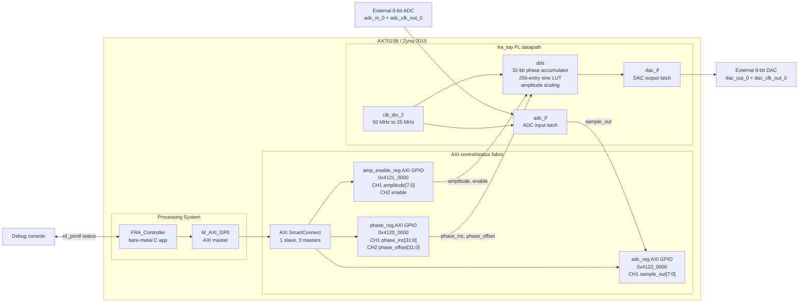

# PCIE_FRA

PCIE_FRA is a Frequency Response Analyzer prototype for the Alinx AX7015B
Zynq-7015 board. The repository contains a Vivado hardware project, a custom
VHDL datapath for 8-bit ADC/DAC I/O, and a bare-metal Vitis controller running
on the Zynq `ps7_cortexa9_0` processor.

The current checked-in implementation controls the programmable logic through
AXI GPIO registers on the Zynq processing system. A host-side PCIe endpoint,
DMA path, and PC driver are not present in this source tree yet.

## Repository Layout

| Path | Purpose |
| --- | --- |
| `hardware/fra_zynq7015_pcie/fra_zynq7015_pcie.xpr` | Vivado project for the Zynq-7015 design. |
| `hardware/fra_zynq7015_pcie/fra_zynq7015_pcie.srcs/sources_1/new/` | Hand-written VHDL sources for the FRA datapath. |
| `hardware/fra_zynq7015_pcie/fra_zynq7015_pcie.srcs/constrs_1/new/constraints.xdc` | ADC/DAC pin constraints for the board. |
| `hardware/fra_zynq7015_pcie/pcie_fra.xsa` | Exported hardware platform used by Vitis. |
| `software/PCIE_FRA/` | Vitis platform component, BSP, FSBL, hardware export, and generated support files. |
| `software/FRA_Controller/` | Bare-metal Vitis application that configures and exercises the FRA datapath. |
| `docs/` | Board manuals, AD/DA module documentation, component datasheets, and a Draw.io architecture sketch. |

## Hardware Target

- Board/device: Alinx AX7015B with Xilinx `xc7z015clg485-2`.
- Processing system clock into PL: 50 MHz `FCLK_CLK0`.
- FRA sample/DAC clock: 25 MHz, generated by `clk_div_2`.
- External data path: 8-bit ADC input, 8-bit DAC output, and separate ADC/DAC clock outputs.
- I/O standard: `LVCMOS33` in the active XDC constraints.

## Architecture Overview



## Programmable Logic

The custom PL logic is centered on `fra_top.vhd`:

- `clk_div_2.vhd` divides the 50 MHz PS fabric clock to 25 MHz.
- `adc_if.vhd` registers the external 8-bit ADC sample bus.
- `dds.vhd` implements a 32-bit phase accumulator, phase offset, amplitude
  scaling, enable control, and midscale output when disabled.
- `sineLUT.vhd` provides a 256-sample 8-bit offset-binary sine lookup table.
- `dac_if.vhd` registers the DDS output onto the external 8-bit DAC bus.

## AXI Register Map

| Register block | Base address | Channel | Direction | Width | Connected signal |
| --- | ---: | --- | --- | ---: | --- |
| `phase_reg` | `0x4120_0000` | 1 | PS to PL | 32 | `phase_inc` |
| `phase_reg` | `0x4120_0000` | 2 | PS to PL | 32 | `phase_ofst` |
| `amp_enable_reg` | `0x4121_0000` | 1 | PS to PL | 8 | `amplitude` |
| `amp_enable_reg` | `0x4121_0000` | 2 | PS to PL | 1 | `enable` |
| `adc_reg` | `0x4122_0000` | 1 | PL to PS | 8 | `sample_out` |

These addresses are generated into the BSP as `XPAR_PHASE_REG_BASEADDR`,
`XPAR_AMP_ENABLE_REG_BASEADDR`, and `XPAR_ADC_REG_BASEADDR`.

## Firmware Behavior

`software/FRA_Controller/src/main.c` initializes the three AXI GPIO blocks,
prints their base addresses, configures the DDS, and then runs one of two
runtime modes:

- Sweep mode: enabled by the current `RUN_SWEEP = 1` setting. The firmware
  repeatedly performs a logarithmic sweep from 10 Hz to 20 kHz with 20 points
  and 100 ms dwell per point.
- ADC monitor mode: available by setting `RUN_SWEEP = 0`. The firmware polls
  `sample_out`, then reports min/max/average sample statistics or prints on
  change depending on `PRINT_ON_CHANGE`.

The DDS phase increment is calculated as:

```text
phase_inc = round(output_frequency_hz * 2^32 / 25_000_000)
```

## Build and Run Notes

1. Open the Vivado project at
   `hardware/fra_zynq7015_pcie/fra_zynq7015_pcie.xpr`.
2. Build or update the bitstream and export the hardware platform to XSA.
3. Open the Vitis workspace components under `software/`.
4. Use `software/PCIE_FRA` as the platform and build/run
   `software/FRA_Controller` on `ps7_cortexa9_0`.

Generated Vivado/Vitis outputs are currently checked into the repository,
including implementation runs, BSP files, the exported XSA, FSBL sources, and
bitstreams. The hand-authored project logic is primarily the VHDL under
`hardware/.../sources_1/new/` and the controller application under
`software/FRA_Controller/src/`.

## Current Scope

The checked-in design is a useful hardware bring-up and DDS sweep controller.
It does not yet include host-side PCIe software, DMA streaming, or completed
frequency-response measurement math such as synchronous detection, gain/phase
calculation, or result buffering.
