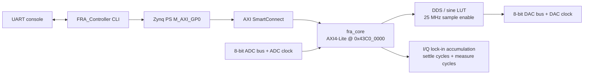

# PCIE_FRA

PCIE_FRA is a standalone Frequency Response Analyzer for the Alinx AX7015B
Zynq-7015 board. The current implementation generates a DDS stimulus in PL,
captures the 8-bit ADC response, performs synchronous I/Q accumulation in a
custom AXI4-Lite FRA core, and exposes a bare-metal UART CLI for calibration
and sweeps.

PCIe endpoint logic, DMA streaming, host drivers, and a PC GUI are intentionally
out of scope for this revision.

## Repository Layout

| Path | Purpose |
| --- | --- |
| `hardware/fra_zynq7015_pcie/fra_zynq7015_pcie.xpr` | Vivado 2025.1 project for `xc7z015clg485-2`. |
| `hardware/fra_zynq7015_pcie/fra_zynq7015_pcie.srcs/sources_1/new/fra_core.vhd` | AXI4-Lite FRA measurement core. |
| `hardware/fra_zynq7015_pcie/fra_zynq7015_pcie.srcs/sim_1/new/tb_fra_core.vhd` | Self-checking RTL testbench for the core. |
| `hardware/fra_zynq7015_pcie/scripts/rebuild_functional_fra_bd.tcl` | Vivado script that replaces the GPIO prototype BD wiring with `fra_core`. |
| `hardware/fra_zynq7015_pcie/fra_zynq7015_pcie.srcs/constrs_1/new/constraints.xdc` | ADC/DAC pin and timing constraints. |
| `software/FRA_Controller/src/main.c` | Bare-metal UART CLI and sweep controller. |
| `software/PCIE_FRA/` | Vitis platform/BSP/FSBL workspace generated from the exported XSA. |
| `docs/` | Board manuals, AD/DA module references, and architecture notes. |

## Hardware Architecture



`fra_core` runs from the 50 MHz PS `FCLK_CLK0` clock and uses a 25 MHz
clock-enable for DAC update, ADC sampling, and I/Q accumulation. The exported
ADC/DAC clocks are generated from a register for the external converters, but
they are not used as internal fabric clocks.

The measurement core:

- Converts ADC offset-binary samples to signed samples around midscale.
- Generates in-phase and quadrature references from the DDS phase.
- Accumulates signed 64-bit `I` and `Q` over whole DDS cycles.
- Supports configurable settle cycles and measurement cycles.
- Reports sample count, ADC min/max, last sample, clipping, low-signal,
  overflow, config-error, busy, and done status.

## AXI Register Map

The Vivado rebuild script assigns `fra_core` to `0x43C0_0000`.

| Offset | Name | Access | Description |
| ---: | --- | --- | --- |
| `0x00` | `VERSION` | RO | Core version, currently `0x00010000`. |
| `0x04` | `CONTROL` | RW/W1P | Bit 0 `DDS_ENABLE`, bit 1 `START`, bit 2 `CLEAR_DONE`, bit 3 `RESET_PHASE_ON_START`. |
| `0x08` | `STATUS` | RO | Bit 0 `BUSY`, bit 1 `DONE`, bit 2 `OVERFLOW`, bit 3 `ADC_CLIP`, bit 4 `LOW_SIGNAL`, bit 5 `CONFIG_ERR`. |
| `0x0C` | `PHASE_INC` | RW | DDS phase increment. |
| `0x10` | `PHASE_OFFSET` | RW | DDS phase offset. |
| `0x14` | `AMPLITUDE` | RW | 8-bit DDS amplitude. |
| `0x18` | `SETTLE_CYCLES` | RW | Whole DDS cycles ignored before measurement. |
| `0x1C` | `MEASURE_CYCLES` | RW | Whole DDS cycles accumulated; must be nonzero. |
| `0x20` | `SAMPLE_COUNT` | RO | Samples accumulated for the last result. |
| `0x24` / `0x28` | `I_ACC_LO` / `I_ACC_HI` | RO | Signed 64-bit in-phase accumulator. |
| `0x2C` / `0x30` | `Q_ACC_LO` / `Q_ACC_HI` | RO | Signed 64-bit quadrature accumulator. |
| `0x34` | `ADC_MIN_MAX` | RO | Bits `[7:0]` min, bits `[15:8]` max. |
| `0x38` | `LAST_SAMPLE` | RO | Last ADC sample, bits `[7:0]`. |

The firmware falls back to `0x43C0_0000` if the regenerated BSP has not yet
provided `XPAR_FRA_CORE_0_BASEADDR`.

## Firmware CLI

Connect to the board UART, then use:

```text
help
id
status
set start <hz>
set stop <hz>
set points <1..64>
set amp <0..255>
set settle <cycles>
set measure <cycles>
single <hz>
cal
sweep
```

Defaults are 10 Hz to 20 kHz, 20 log-spaced points, amplitude 128, 2 settle
cycles, and 4 measure cycles. `cal` stores a RAM-only loopback baseline for the
active sweep setup. `sweep` prints CSV rows:

```text
idx,freq_hz,mag_counts,phase_deg,norm_db,norm_phase_deg,i_acc,q_acc,samples,adc_min,adc_max,status
```

`norm_db` and `norm_phase_deg` are `nan` until a calibration exists for the
corresponding sweep point.

## Build

1. Open or run Vivado 2025.1 from the repo root.
2. Rebuild the block design PL side:

   ```bash
   vivado -mode batch -source hardware/fra_zynq7015_pcie/scripts/rebuild_functional_fra_bd.tcl
   ```

3. In Vivado, run synthesis, implementation, timing, DRC, methodology, and
   bitstream generation for `hardware/fra_zynq7015_pcie/fra_zynq7015_pcie.xpr`.
4. Export the hardware platform with the bitstream to a new XSA.
5. Regenerate the Vitis platform/BSP from that XSA, then build
   `software/FRA_Controller`.

Generated Vivado/Vitis runs, bitstreams, XSAs, ELFs, logs, and caches should be
treated as build or release artifacts, not source. The root `.gitignore` is set
up for new generated files; older checked-in generated outputs may still exist
until they are removed from version control in a cleanup commit.

## Validation

Minimum final validation for this revision:

1. Run the RTL testbench `tb_fra_core`.
2. Confirm Vivado timing is met and methodology has no critical warnings from
   unconstrained FRA clocks.
3. Scope DAC output plus ADC/DAC clocks at 10 Hz, 1 kHz, and 20 kHz.
4. Wire DAC output to ADC input, run `cal`, then `sweep`; valid loopback points
   should normalize close to 0 dB and 0 degrees without ADC clipping.
5. Measure a simple RC low-pass and compare against the expected response. The
   acceptance target is within +/-2 dB and +/-15 degrees for valid, unclipped
   points.
