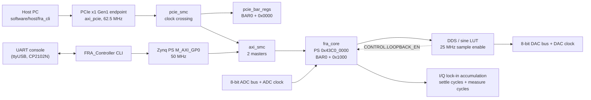

# PCIE_FRA

PCIE_FRA is a Frequency Response Analyzer for the Alinx AX7015B Zynq-7015
board. It generates a DDS stimulus in PL, captures the 8-bit ADC response,
performs synchronous I/Q accumulation in a custom AXI4-Lite FRA core, and can
be driven from two places at once:

- a bare-metal **UART CLI** on the board (`software/FRA_Controller`), and
- a **host PCIe application** over the board's x1 Gen1 endpoint
  (`software/host`).

The PCIe endpoint is validated on hardware: the link trains at 2.5 GT/s x1, the
device enumerates as `10ee:7021`, and the host reads and writes both BAR0
windows. The 8 KB BAR0 decodes `pcie_bar_regs` (identity/scratch) at `+0x0000`
and `fra_core` itself at `+0x1000`, so a host can run a complete sweep without
touching the UART.

`fra_core` also has a gateware DAC→ADC loopback (`CONTROL.LOOPBACK_EN`), which
makes the whole digital chain self-testable with **no AN108 AD/DA module
fitted**. That is the current bench configuration.

DMA streaming and a PC GUI remain out of scope for this revision.

## Quick start (host side)

```bash
make -C software/host
sudo software/host/scripts/fra-pcie-setup.sh    # one-time: binds vfio-pci

software/host/fra_bar_test                      # BAR0 bring-up check
software/host/fra_cli id                        # identity + link state
software/host/fra_cli selftest                  # end-to-end, needs no AD/DA module
software/host/fra_cli --loopback cal
software/host/fra_cli --loopback sweep --csv sweep.csv
```

On a machine with Secure Boot enabled the kernel runs in lockdown mode, where
`mmap()` of a PCI BAR through sysfs fails for every process including root. The
setup script binds the endpoint to `vfio-pci`, which is the supported route; the
tools fall back to sysfs where lockdown is off. See `software/host/README.md`.

`scripts/verify_system.sh` runs the whole chain — enumeration, link state,
driver binding, BAR0 access, the host loopback self-test and the board UART —
and prints a pass/fail summary. Measured results are in
`docs/pcie_host_validation.md`.

## Current state

Working and validated on hardware:

- PCIe link trains at 2.5 GT/s x1; the host enumerates `10ee:7021` with an
  8 KB BAR0 and reads/writes both windows.
- A host-driven sweep runs end to end over PCIe and agrees with the board's
  UART firmware to the printed precision.
- The gateware loopback closes the measurement loop with no AD/DA module
  fitted, so the whole digital chain is self-testable.
- QSPI is flashed and verified with the current bitstream + firmware.

**Next step: a full power-off and power-on** (the board is slot-powered, so a
warm reboot will not do it), then:

```bash
scripts/verify_system.sh
```

That is the outstanding validation of the flashed image. It has not yet been
observed booting from QSPI, because validating it in place with a soft reset
does not work — see "Recovering the board after flashing" in
`docs/pcie_host_validation.md`. The QSPI write itself verified byte-for-byte,
the bitstream and firmware were each tested over JTAG before flashing, and the
FSBL and its `ps7_init` are byte-identical to the previously booting image.

After that, the only remaining item is check 8 in Validation: measuring a real
RC low-pass, which needs the AN108 AD/DA module connected. Nothing in software
or gateware blocks it.

## Repository Layout

| Path | Purpose |
| --- | --- |
| `hardware/fra_zynq7015_pcie/fra_zynq7015_pcie.xpr` | Vivado project for `xc7z015clg485-2` (created in 2025.1, builds under 2026.1). |
| `hardware/fra_zynq7015_pcie/fra_zynq7015_pcie.srcs/sources_1/new/fra_core.vhd` | AXI4-Lite FRA measurement core. |
| `hardware/fra_zynq7015_pcie/fra_zynq7015_pcie.srcs/sources_1/new/pcie_bar_regs.vhd` | BAR0 AXI4-Lite register file behind the PCIe endpoint (board ID/version/scratch/control). |
| `hardware/fra_zynq7015_pcie/fra_zynq7015_pcie.srcs/sim_1/new/tb_fra_core.vhd` | Self-checking RTL testbench for the FRA core. |
| `hardware/fra_zynq7015_pcie/fra_zynq7015_pcie.srcs/constrs_1/new/constraints.xdc` | ADC/DAC pin and timing constraints. |
| `hardware/fra_zynq7015_pcie/fra_zynq7015_pcie.srcs/constrs_1/new/pcie_pins.xdc` | PCIe refclk/serial-pair/PERST pin constraints. |
| `hardware/fra_zynq7015_pcie/scripts/rebuild_functional_fra_bd.tcl` | Vivado script that replaces the GPIO prototype BD wiring with `fra_core` (PCIe-free BD). |
| `hardware/fra_zynq7015_pcie/scripts/run_pcie_impl_signoff.tcl` | Signoff build (impl→bitstream→XSA) for the current PCIe-integrated project; preserves the PCIe endpoint. |
| `software/FRA_Controller/src/main.c` | Bare-metal UART CLI and sweep controller (mirrors the CLI on both PS UART0/UART1). |
| `software/FRA_Controller/Makefile` | Command-line firmware build against the checked-in BSP (Vitis 2026.1 removed XSCT). |
| `software/PCIE_FRA/` | Vitis platform/BSP/FSBL workspace generated from the exported XSA. |
| `software/host/` | Linux host tools: `fra_cli` (sweeps over PCIe), `fra_bar_test`, VFIO setup scripts. See its `README.md`. |
| `scripts/build_boot_image.sh` | Packs FSBL + bitstream + app into `BOOT.BIN`. |
| `scripts/flash_qspi.sh` | Writes `BOOT.BIN` to QSPI over JTAG. |
| `scripts/program_fpga_jtag.sh` | Volatile bitstream load over JTAG, for trying gateware before flashing. |
| `scripts/verify_system.sh` | End-to-end pass/fail check of the whole system. |
| `docs/PCIE_BAR0_REGISTER_MAP.md` | BAR0 window layout, address map and register tables. |
| `docs/pcie_host_validation.md` | On-hardware PCIe + loopback validation results. |
| `docs/` | Board manuals, AD/DA module references, architecture notes. |

## Hardware Architecture


```mermaid
flowchart LR
    console["UART console\n(ttyUSB, CP2102N)"] <--> app["FRA_Controller CLI"]
    app --> gp0["Zynq PS M_AXI_GP0\n50 MHz"]

    hostpc["Host PC\nsoftware/host/fra_cli"] --> ep["PCIe x1 Gen1 endpoint\naxi_pcie, 62.5 MHz"]
    ep --> psmc["pcie_smc\nclock crossing"]
    psmc --> bar["pcie_bar_regs\nBAR0 + 0x0000"]
    psmc --> axi

    gp0 --> axi["axi_smc\n2 masters"]
    axi --> core["fra_core\nPS 0x43C0_0000\nBAR0 + 0x1000"]

    core --> dds["DDS / sine LUT\n25 MHz sample enable"]
    dds --> dac["8-bit DAC bus + DAC clock"]
    adc["8-bit ADC bus + ADC clock"] --> core
    dds -. "CONTROL.LOOPBACK_EN" .-> core

    core --> lockin["I/Q lock-in accumulation\nsettle cycles + measure cycles"]
```

`fra_core` runs from the 50 MHz PS `FCLK_CLK0` clock and uses a 25 MHz
clock-enable for DAC update, ADC sampling, and I/Q accumulation. The exported
ADC/DAC clocks are generated from a register for the external converters, but
they are not used as internal fabric clocks. The DAC clock is inverted relative
to the ADC clock so `dac_out` is stable before the AD9708 positive latch edge.

The PCIe endpoint runs in its own `axi_pcie/axi_aclk_out` domain (62.5 MHz).
`pcie_smc` does the crossing into the PS fabric clock, so BAR0 reaches both
`pcie_bar_regs` (which stays in the PCIe domain, and therefore answers even
when the PS is in reset) and `fra_core` (which does not — it needs `FCLK_CLK0`
running). Both the PS and the host arbitrate onto `fra_core` through `axi_smc`;
drive the core from one side at a time. See `docs/PCIE_BAR0_REGISTER_MAP.md`.

With `CONTROL.LOOPBACK_EN` set, `fra_core` substitutes the DAC word for the ADC
pins internally. That closes the measurement loop in gateware, which is how the
system is exercised end to end while the AN108 AD/DA module is unfitted.

The measurement core:

- Converts ADC offset-binary samples to signed samples around midscale.
- Generates in-phase and quadrature references from the DDS phase.
- Accumulates signed 64-bit `I` and `Q` over whole DDS cycles.
- Primes the synchronous sine LUT for one uncounted sample tick on start.
- Supports configurable settle cycles and measurement cycles.
- Reports sample count, ADC min/max, last sample, clipping, low-signal,
  overflow, config-error, busy, and done status.

## AXI Register Map

`fra_core` is mapped at `0x43C0_0000` in the PS address space and at
`BAR0 + 0x1000` in the PCIe master's space. The registers below are the same
block seen from either side.

| Offset | Name | Access | Description |
| ---: | --- | --- | --- |
| `0x00` | `VERSION` | RO | Core version, currently `0x00010100` (1.1.0). |
| `0x04` | `CONTROL` | RW/W1P | Bit 0 `DDS_ENABLE`, bit 1 `START`, bit 2 `CLEAR_DONE`, bit 3 `RESET_PHASE_ON_START`, bit 4 `LOOPBACK_EN`. |
| `0x08` | `STATUS` | RO | Bit 0 `BUSY`, bit 1 `DONE`, bit 2 `OVERFLOW`, bit 3 `ADC_CLIP`, bit 4 `LOW_SIGNAL`, bit 5 `CONFIG_ERR`. |
| `0x0C` | `PHASE_INC` | RW | DDS phase increment. |
| `0x10` | `PHASE_OFFSET` | RW | DDS phase offset. |
| `0x14` | `AMPLITUDE` | RW | 8-bit DDS amplitude. |
| `0x18` | `SETTLE_CYCLES` | RW | Whole DDS cycles ignored before measurement. |
| `0x1C` | `MEASURE_CYCLES` | RW | Whole DDS cycles accumulated; must be nonzero. |
| `0x20` | `SAMPLE_COUNT` | RO | Samples accumulated for the last result. |
| `0x24` / `0x28` | `I_ACC_LO` / `I_ACC_HI` | RO | Signed 64-bit in-phase accumulator. |
| `0x2C` / `0x30` | `Q_ACC_LO` / `Q_ACC_HI` | RO | Signed 64-bit quadrature accumulator. |
| `0x34` | `ADC_MIN_MAX` | RO | Bits `[7:0]` min, bits `[15:8]` max. |
| `0x38` | `LAST_SAMPLE` | RO | Last ADC sample, bits `[7:0]`. |

The firmware falls back to `0x43C0_0000` if the regenerated BSP has not yet
provided `XPAR_FRA_CORE_0_BASEADDR`.

## Firmware CLI

Connect to the board UART, then use:

```text
help
id
status
set start <hz>
set stop <hz>
set points <1..64>
set amp <0..255>
set settle <cycles>
set measure <cycles>
single <hz>
cal
sweep
loopback <on|off>
```

Defaults are 10 Hz to 20 kHz, 20 log-spaced points, amplitude 128, 2 settle
cycles, and 4 measure cycles. `cal` stores a RAM-only baseline for the active
sweep setup; `loopback on` switches to the internal gateware loopback and
clears that baseline, since the measured path just changed. `sweep` prints CSV
rows:

```text
idx,freq_hz,mag_counts,phase_deg,norm_db,norm_phase_deg,i_acc,q_acc,samples,adc_min,adc_max,status
```

`norm_db` and `norm_phase_deg` are `nan` until a calibration exists for the
corresponding valid sweep point. Firmware rejects frequencies that do not
resolve to a nonzero DDS phase increment or are at or above the 12.5 MHz
Nyquist limit. Hardware validation for this revision remains scoped to the
default 10 Hz to 20 kHz sweep range.

## Build

The project was created with Vivado 2025.1 and builds under 2026.1; the BD
script upgrades the locked IP in place on first run. Vitis 2026.1 removed
`xsct`, so the firmware and boot-image steps are plain shell/Make rather than
the old IDE flow.

```bash
# 1. Gateware: BD wiring (PCIe endpoint + BAR0 -> fra_core), then signoff build.
vivado -mode batch -source hardware/fra_zynq7015_pcie/scripts/add_pcie_endpoint.tcl
vivado -mode batch -source hardware/fra_zynq7015_pcie/scripts/run_pcie_impl_signoff.tcl

# 2. Firmware ELF (uses the checked-in standalone BSP).
make -C software/FRA_Controller

# 3. Boot image, then QSPI.
scripts/build_boot_image.sh
scripts/flash_qspi.sh

# 4. Host tools.
make -C software/host
sudo software/host/scripts/fra-pcie-setup.sh   # one-time
```

`run_pcie_impl_signoff.tcl` only writes the BIT and XSA on a clean pass: zero
setup/hold violations, ADC/DAC/PCIe reference clocks constrained, and no DRC or
methodology Errors or Critical Warnings.

To try gateware without committing it to flash, `scripts/program_fpga_jtag.sh`
loads a bitstream over JTAG — but note it drops the live PCIe link, so follow it
with `sudo software/host/scripts/fra-pcie-rescan.sh`.

### Boot ordering matters

The board's boot mode strap is QSPI (`SLCR.BOOT_MODE` @ `0xF800025C` reads
`0x1`). That is required, not incidental: the FPGA must be configured — and the
PCIe endpoint linked — before the host POSTs and enumerates the bus. After
reflashing QSPI, do a **full power-off and power-on**, not a warm reboot, so the
board actually reconfigures from flash.

Generated Vivado/Vitis runs, bitstreams, XSAs, ELFs, logs, and caches should be
treated as build or release artifacts, not source. The root `.gitignore` is set
up for new generated files; older checked-in generated outputs may still exist
until they are removed from version control in a cleanup commit. The current
block-design rebuild script depends on the checked-in Vivado project and
existing PS block design; it does not recreate the complete Vivado project from
an empty directory.

## Validation

| # | Check | Status |
| --- | --- | --- |
| 1 | RTL testbench `tb_fra_core` (now also covers `LOOPBACK_EN`) | **Pass** |
| 2 | Timing met, ADC/DAC/PCIe clocks constrained, no critical DRC/methodology | **Pass** — WNS +2.016 ns, WHS +0.060 ns |
| 3 | Scope DAC output plus ADC/DAC clocks at 10 Hz, 1 kHz, 20 kHz | Done in an earlier revision |
| 4 | Wire DAC to ADC, `cal` then `sweep`, normalise to ~0 dB / ~0° | **Pass** — `docs/loopback_accuracy_report.md`: residuals ~0.002 dB / ~0.01° |
| 5 | PCIe link training and host enumeration | **Pass** — 2.5 GT/s x1, `10ee:7021`, 8 KB BAR0 |
| 6 | Host BAR0 read/write, including per-byte `WSTRB` | **Pass** — `software/host/fra_bar_test` |
| 7 | Host-driven sweep over PCIe via the gateware loopback | **Pass** — `fra_cli selftest` |
| 8 | Measure an RC low-pass, within +/-2 dB and +/-15° | **Open** — needs the AN108 module fitted |

Check 8 is the only remaining gap, and it is a hardware-availability gap rather
than a software one: the AD/DA module is not currently connected, so nothing
downstream of `dac_out` or upstream of `adc_in` can be exercised. Everything
either side of that boundary — DDS, sampling, I/Q accumulation, both register
interfaces, the PCIe path and the host tooling — is covered by checks 1-7.
