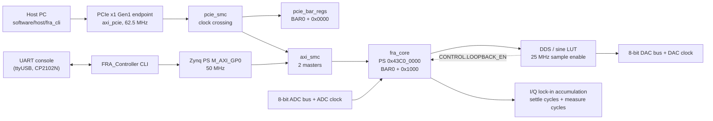

# PCIE_FRA

[](https://github.com/Tommy270502/PCIE_FRA/actions/workflows/ci.yml)

A Frequency Response Analyzer for the Alinx AX7015B (Zynq-7015,
`xc7z015clg485-2`). The PL generates a DDS stimulus, samples an 8-bit ADC, and
does synchronous I/Q lock-in accumulation in a custom AXI4-Lite core. It is
driven from two places at once:

- a bare-metal **UART CLI** on the board — `software/FRA_Controller`
- a **Linux host application** over the board's PCIe x1 Gen1 endpoint —
  `software/host`

The endpoint is validated on hardware: the link trains at 2.5 GT/s x1, the
device enumerates as `10ee:7021`, and the host reads and writes both BAR0
windows. The 8 KB BAR0 decodes `pcie_bar_regs` (identity/scratch) at `+0x0000`
and `fra_core` itself at `+0x1000`, so a host can run a complete sweep without
touching the UART.

`fra_core` also has a gateware DAC→ADC loopback (`CONTROL.LOOPBACK_EN`), which
makes the whole digital chain self-testable with **no AN108 AD/DA module
fitted**. That is the current bench configuration, and it is why everything
except the analog path could be proven.

DMA streaming and a PC GUI are out of scope for this revision.

## Quick start

```bash
make check                                      # lint + RTL testbenches, no board needed
```

With the board fitted and booted:

```bash
make host
sudo software/host/scripts/fra-pcie-setup.sh    # one-time: binds vfio-pci

software/host/fra_bar_test                      # BAR0 bring-up check
software/host/fra_cli id                        # identity + link state
software/host/fra_cli selftest                  # end-to-end, needs no AD/DA module
software/host/fra_cli --loopback cal
software/host/fra_cli --loopback sweep --csv sweep.csv
```

`make help` lists every target. `make verify` runs the whole chain —
enumeration, link state, driver binding, BAR0 access, the host loopback
self-test and the board UART — and prints a pass/fail summary.

On a machine with Secure Boot the kernel runs in lockdown `integrity` mode,
where `mmap()` of a PCI BAR through sysfs fails for **every** process including
root. The setup script binds the endpoint to `vfio-pci`, which is the supported
route; the tools fall back to sysfs where lockdown is off. Details in
[`software/host/README.md`](software/host/README.md).

## Current state

`scripts/verify_system.sh` passes on a cold-booted board:

```
== 1. PCIe enumeration ==
  PASS  endpoint present at 0000:08:00.0
  PASS  link 2.5 GT/s PCIe x1
  PASS  bound to vfio-pci
== 2. Host tools build ==      PASS
== 3. BAR0 access ==           PASS  BOARD_ID 0xA7015B00, VERSION 0x00010100
== 4. Host loopback self-test over PCIe ==  PASS  (4 frequencies)
== 5. Board UART console ==    PASS  firmware alive, core version 0x00010100
```

Validated on hardware:

- The PCIe link trains at 2.5 GT/s x1; the host enumerates `10ee:7021` with an
  8 KB BAR0 and reads and writes both windows.
- A host-driven sweep runs end to end over PCIe and agrees with the board's UART
  firmware to the printed precision.
- The gateware loopback closes the measurement loop with no AD/DA module fitted.
- **QSPI boot.** After a cold power cycle the board configures the FPGA from
  flash before the host POSTs — so the endpoint is enumerable — and the FSBL
  then starts the application, which answers on the console reporting core
  version `0x00010100`.

One item remains open — measuring a real RC low-pass, the last row of
[Validation](#validation) — and it needs the AN108 module physically connected.
Nothing in software or gateware blocks it.

## Architecture


```mermaid
flowchart LR
    console["UART console\n(ttyUSB, CP2102N)"] <--> app["FRA_Controller CLI"]
    app --> gp0["Zynq PS M_AXI_GP0\n50 MHz"]

    hostpc["Host PC\nsoftware/host/fra_cli"] --> ep["PCIe x1 Gen1 endpoint\naxi_pcie, 62.5 MHz"]
    ep --> psmc["pcie_smc\nclock crossing"]
    psmc --> bar["pcie_bar_regs\nBAR0 + 0x0000"]
    psmc --> axi

    gp0 --> axi["axi_smc\n2 masters"]
    axi --> core["fra_core\nPS 0x43C0_0000\nBAR0 + 0x1000"]

    core --> dds["DDS / sine LUT\n25 MHz sample enable"]
    dds --> dac["8-bit DAC bus + DAC clock"]
    adc["8-bit ADC bus + ADC clock"] --> core
    dds -. "CONTROL.LOOPBACK_EN" .-> core

    core --> lockin["I/Q lock-in accumulation\nsettle cycles + measure cycles"]
```

### Two masters, one core

`fra_core` has a single AXI4-Lite slave port, reached by **both** the PS and the
host. It appears at `0x43C0_0000` in the PS address space and at `BAR0 + 0x1000`
in the PCIe master's space — the same block, two address spaces.

AXI arbitration makes individual transactions safe, but it does **not** serialise
a *sequence* of register writes. A measurement must therefore be driven from one
side at a time.

### Clock domains

`fra_core` runs from the 50 MHz PS `FCLK_CLK0` and uses a 25 MHz clock-enable for
DAC update, ADC sampling and I/Q accumulation. The exported ADC/DAC clocks are
generated from a register for the external converters and are not used as
internal fabric clocks; the DAC clock is inverted relative to the ADC clock so
`dac_out` is stable before the AD9708 positive latch edge.

The endpoint runs in its own `axi_pcie/axi_aclk_out` domain at 62.5 MHz, and
`pcie_smc` does the crossing into the PS fabric clock. `pcie_bar_regs` is
deliberately left in the PCIe domain so the host can still read identity
registers when the PS is down. `fra_core` cannot be — it is clocked by
`FCLK_CLK0`.

> **Consequence:** do not read `BAR0 + 0x1000` while the PS state is unknown.
> With `FCLK_CLK0` stopped the AXI read never completes and the host takes a
> PCIe completion timeout.

The whole topology is produced by `add_pcie_endpoint.tcl`, which tears down and
rebuilds its own cells on every run. Edit that script, not the `.bd`.

### Loopback timing

`dac_out_i` is written on the sample tick; `adc_sample_i` is captured on the
opposite phase. `CONTROL.LOOPBACK_EN` therefore presents the *previous* tick's
value — exactly one sample of delay:

- expected phase = `-360 × f / 25e6` degrees
- expected magnitude = `127 × amp/255` counts

`mag_counts` is a peak ADC deviation in counts, not normalised to unity. Both
are checked by `fra_cli selftest`; measured 63.685 against 63.749 predicted. The
0.1% deficit is rounding in `scale_lut`'s exact divide-by-255, and it calibrates
out.

### The measurement core

- Converts ADC offset-binary samples to signed samples around midscale.
- Generates in-phase and quadrature references from the DDS phase.
- Accumulates signed 64-bit `I` and `Q` over whole DDS cycles.
- Primes the synchronous sine LUT for one uncounted sample tick on start.
- Supports configurable settle cycles and measurement cycles.
- Reports sample count, ADC min/max, last sample, and clipping, low-signal,
  overflow, config-error, busy and done status.

Register tables for both `fra_core` and `pcie_bar_regs` are in
**[docs/register-map.md](docs/register-map.md)** — that file is the authority
when the RTL, `fra_pcie.h` and the firmware's defines disagree.

## Firmware CLI

Connect to the board UART (`scripts/find_fra_uart.sh` resolves it), then:

```text
help                     id                       status
set start <hz>           set stop <hz>            set points <1..64>
set amp <0..255>         set settle <cycles>      set measure <cycles>
single <hz>              sweep                    cal
loopback <on|off>
```

Defaults are 10 Hz to 20 kHz, 20 log-spaced points, amplitude 128, 2 settle
cycles and 4 measure cycles. `cal` stores a RAM-only baseline for the active
sweep setup; `loopback on` switches to the internal gateware loopback and clears
that baseline, since the measured path just changed. `sweep` prints CSV rows:

```text
idx,freq_hz,mag_counts,phase_deg,norm_db,norm_phase_deg,i_acc,q_acc,samples,adc_min,adc_max,status
```

`norm_db` and `norm_phase_deg` read `nan` until a calibration exists for the
corresponding valid sweep point. The firmware rejects frequencies that do not
resolve to a nonzero DDS phase increment, or that are at or above the 12.5 MHz
Nyquist limit. Hardware validation for this revision is scoped to the default
10 Hz to 20 kHz range.

## Building

The project was created in Vivado 2025.1 and builds under **2026.1**; the BD
script upgrades the locked IP in place on first run. Vitis 2026.1 removed
`xsct`, so the firmware and boot-image steps are plain shell and Make rather
than the old IDE flow.

```bash
make all        # host tools, BSP and firmware -- no Vivado, no board
make gateware   # BD rewire + signoff build (slow)
make boot       # FSBL + bitstream + app -> BOOT.BIN
make flash      # BOOT.BIN -> QSPI over JTAG
```

Toolchain paths default to `~/Xilinx/2026.1` and are overridable:

```bash
make VITIS=/opt/Xilinx/2026.1/Vitis VIVADO=/opt/Xilinx/2026.1/Vivado/bin/vivado
```

`run_pcie_impl_signoff.tcl` only writes the BIT and XSA on a clean pass: zero
setup/hold violations, ADC/DAC/PCIe reference clocks constrained, and no DRC or
methodology errors or critical warnings.

To try gateware without committing it to flash, `make jtag` loads a bitstream and
the application over JTAG. It drops the live PCIe link, so follow it with
`sudo software/host/scripts/fra-pcie-rescan.sh`.

### Boot ordering matters

The boot mode strap is QSPI (`SLCR.BOOT_MODE` @ `0xF800_025C` reads `0x1`). That
is load-bearing, not incidental: the FPGA must be configured — and the PCIe
endpoint linked — *before the host POSTs*, or the endpoint is never enumerated.
`BOOT.BIN` is FSBL + bitstream + application; the FSBL configures the PL and then
starts the app.

The board is slot-powered, so only a full host shutdown power-cycles it. After
reflashing QSPI, **power off and on** — a warm reboot does not reconfigure the
FPGA, and so does not validate the flash.

## Repository layout

| Path | |
| --- | --- |
| `Makefile` | Single entry point for every build, test and deploy step. |
| `hardware/fra_zynq7015_pcie/` | Vivado project for `xc7z015clg485-2`. |
| &nbsp;&nbsp;`…/sources_1/new/fra_core.vhd` | AXI4-Lite FRA measurement core. |
| &nbsp;&nbsp;`…/sources_1/new/pcie_bar_regs.vhd` | BAR0 register file behind the endpoint. |
| &nbsp;&nbsp;`…/sim_1/new/` | Self-checking testbenches for both. |
| &nbsp;&nbsp;`…/constrs_1/new/` | ADC/DAC pin and timing constraints; PCIe refclk, serial pair and PERST. |
| &nbsp;&nbsp;`…/scripts/add_pcie_endpoint.tcl` | Builds the block design. Edit this, not the `.bd`. |
| &nbsp;&nbsp;`…/scripts/run_pcie_impl_signoff.tcl` | Signoff build: impl → bitstream → XSA, behind the gates above. |
| `software/FRA_Controller/` | Bare-metal UART CLI and sweep controller. |
| `software/PCIE_FRA/` | Vendored AMD BSP and FSBL sources the firmware links against. |
| `software/host/` | `fra_cli`, `fra_bar_test`, and the VFIO setup scripts. |
| `scripts/build_bsp.sh` | Builds the BSP archives from the vendored sources. |
| `scripts/run_sim.sh` | Runs the testbenches in seconds (xsim or GHDL). |
| `scripts/lint.sh` | Shellcheck plus a warnings-as-errors host build. |
| `scripts/build_boot_image.sh` | Packs FSBL + bitstream + app into `BOOT.BIN`. |
| `scripts/flash_qspi.sh` | Writes `BOOT.BIN` to QSPI over JTAG. |
| `scripts/program_fpga_jtag.sh` | Volatile bitstream + app load over JTAG. |
| `scripts/verify_system.sh` | End-to-end pass/fail check of the whole system. |
| `scripts/find_fra_uart.sh` | Resolves the console by USB VID:PID — `ttyUSB` numbers move. |
| `docs/` | [Register map, validation results and board reference](docs/README.md). |

Everything either tool generates — Vivado runs, bitstreams, XSAs, BSP archives,
ELFs, logs and caches — is a build artifact and is not tracked. See
[CONTRIBUTING.md](CONTRIBUTING.md) for where the line falls and why.

One limitation worth stating plainly: `add_pcie_endpoint.tcl` rewires the block
design inside the checked-in Vivado project. It does not recreate that project
from an empty directory.

## Validation

| # | Check | Status |
| --- | --- | --- |
| 1 | RTL testbench `tb_fra_core`, including `LOOPBACK_EN` | **Pass** |
| 2 | RTL testbench `tb_pcie_bar_regs` | **Pass** |
| 3 | Timing met, ADC/DAC/PCIe clocks constrained, no critical DRC/methodology | **Pass** — WNS +2.016 ns, WHS +0.060 ns |
| 4 | Scope DAC output plus ADC/DAC clocks at 10 Hz, 1 kHz, 20 kHz | Done in an earlier revision |
| 5 | Wire DAC to ADC, `cal` then `sweep`, normalise to ~0 dB / ~0° | **Pass** — [residuals ~0.002 dB / ~0.01°](docs/validation/loopback-accuracy.md) |
| 6 | PCIe link training and host enumeration | **Pass** — 2.5 GT/s x1, `10ee:7021`, 8 KB BAR0 |
| 7 | Host BAR0 read/write, including per-byte `WSTRB` | **Pass** — `software/host/fra_bar_test` |
| 8 | Host-driven sweep over PCIe via the gateware loopback | **Pass** — `fra_cli selftest` |
| 9 | Board boots the flashed image from QSPI | **Pass** — cold boot: endpoint enumerates at POST, firmware answers |
| 10 | Measure an RC low-pass, within ±2 dB and ±15° | **Open** — needs the AN108 module fitted |

Checks 1–9 cover everything on either side of the analog boundary: DDS,
sampling, I/Q accumulation, both register interfaces, the PCIe path and the host
tooling. Measured evidence is in [docs/validation/](docs/validation/).

The open row is not a software gap. Nothing downstream of `dac_out` or upstream of
`adc_in` can be exercised until the AD/DA module is connected — which is exactly
why the gateware loopback exists.

## Licence

MIT — see [LICENSE](LICENSE). `software/PCIE_FRA/` vendors AMD embeddedsw sources
under their own MIT terms, and `docs/board_files/` is redistributed manufacturer
documentation.
