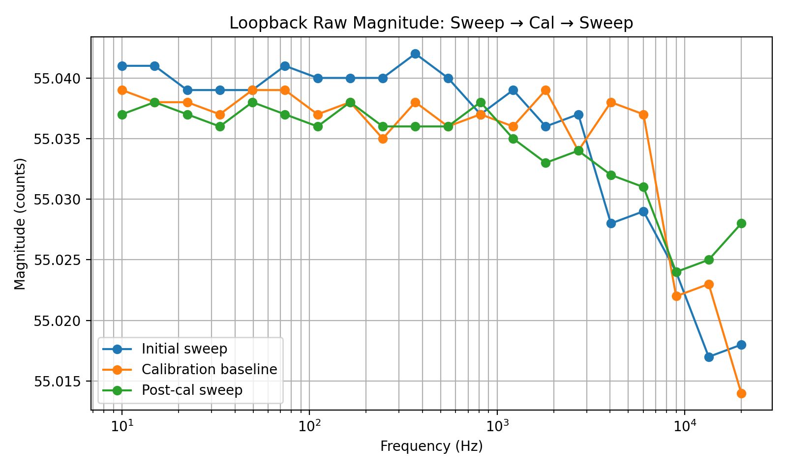
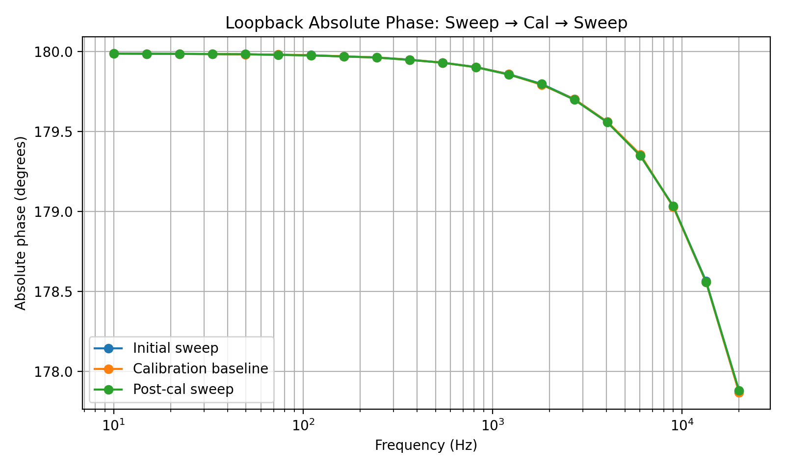
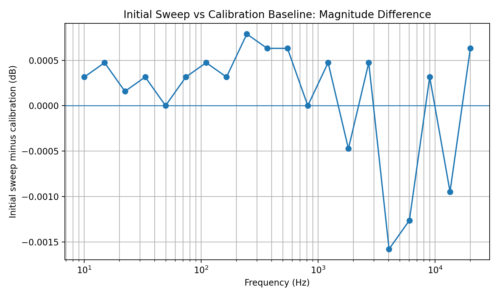
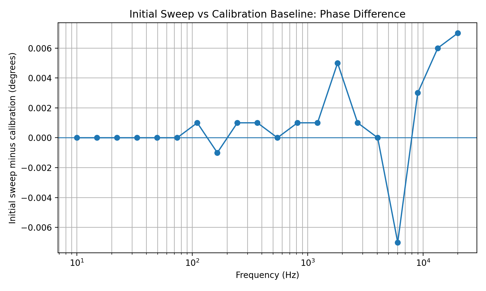
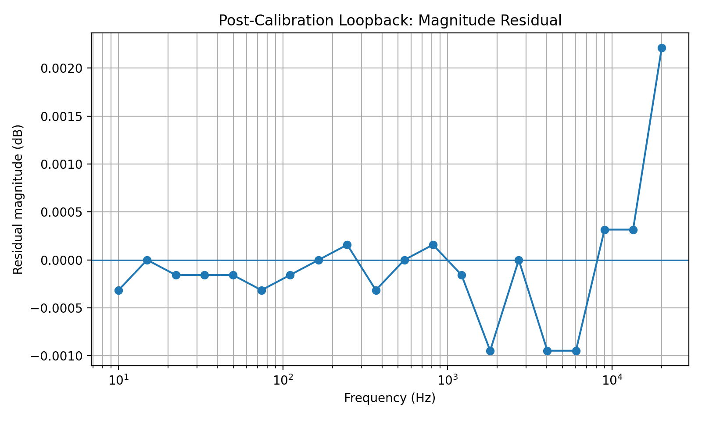
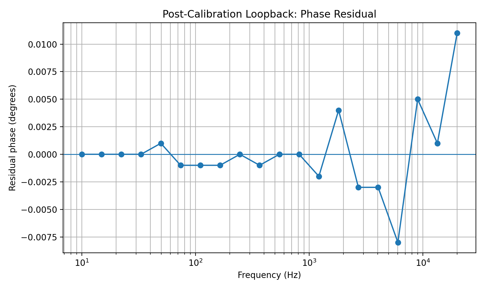

# Loopback Accuracy Validation Report — Sweep → Cal → Sweep

## PCIE_FRA Frequency Response Analyzer

This document reports a second loopback accuracy validation of the `PCIE_FRA` Frequency Response Analyzer.

This run includes the complete validation sequence:

```text
sweep -> cal -> sweep
```

The first `sweep` records the uncalibrated loopback response. The `cal` command then stores the loopback baseline. The final `sweep` verifies that the stored baseline removes the loopback magnitude and phase response.

## Summary

The calibrated loopback result is good. After calibration, the post-calibration sweep returns close to 0 dB and 0 deg over the full default sweep range.

| Quantity | Result |
|---|---:|
| Sweep range | 10 Hz to 20 kHz |
| Sweep points | 20 logarithmically spaced points |
| Post-cal magnitude residual, maximum absolute | 0.0022 dB |
| Post-cal magnitude residual, peak-to-peak | 0.0032 dB |
| Post-cal magnitude residual, RMS | 0.00064 dB |
| Post-cal phase residual, maximum absolute | 0.011 deg |
| Post-cal phase residual, peak-to-peak | 0.019 deg |
| Post-cal phase residual, RMS | 0.00356 deg |
| Worst raw magnitude delta after calibration | 0.014 counts on approximately 55 counts |
| ADC minimum during post-calibration sweep | 69 to 72 counts |
| ADC maximum during post-calibration sweep | 182 to 184 counts |
| Sample count range | 5000 to 9999924 samples |

The result confirms that the loopback baseline is being applied correctly. The remaining post-calibration residuals are at the millidecibel and millidegree level.

## Test Method

The test procedure was:

1. Connect the DAC output directly to the ADC input.
2. Run an initial sweep:

   ```text
   sweep
   ```

3. Run the loopback calibration command:

   ```text
   cal
   ```

4. Run a second sweep:

   ```text
   sweep
   ```

5. Compare the final post-calibration sweep against the calibration baseline.
6. Quantify residual magnitude and phase error.

The firmware CSV output format used for this report was:

```text
idx,freq_hz,mag_counts,phase_deg,norm_db,norm_phase_deg,i_acc,q_acc,samples,adc_min,adc_max,status
```

## Initial Sweep, Calibration Baseline, and Final Sweep

The raw magnitude and absolute phase are highly repeatable between the initial sweep, the calibration baseline, and the post-calibration sweep.



The absolute phase contains the expected loopback phase slope. In this run, the calibration baseline phase changes from approximately 179.987 deg at 10 Hz to approximately 177.869 deg at 20 kHz. That is a total absolute phase change of approximately 2.118 deg across the sweep.



This absolute phase slope is not a problem. It is the loopback path characteristic that calibration is intended to remove. The important property is repeatability, and this dataset shows good repeatability.

## Initial Sweep vs Calibration Baseline

Before applying the calibration result, the initial sweep and the calibration pass already agree closely.

The largest initial-sweep-to-calibration raw magnitude difference was 0.010 counts. The largest initial-sweep-to-calibration phase difference was 0.007 deg. Expressed as magnitude ratio, the largest initial-sweep-to-calibration difference was approximately 0.0016 dB.





This shows that the loopback response is stable between consecutive acquisitions.

## Post-Calibration Magnitude Accuracy

The post-calibration magnitude residual is small.

The worst observed magnitude residual was approximately 0.0022 dB. The total peak-to-peak residual over the complete 10 Hz to 20 kHz sweep was approximately 0.0032 dB, with an RMS residual of approximately 0.00064 dB.



The printed firmware `norm_db` values are rounded to 0.001 dB. For this report, the residual was also recomputed from the raw `mag_counts` values against the calibration baseline.

The largest magnitude residual appears at 20 kHz, where the final sweep reports a slightly larger magnitude than the calibration baseline. This is also the lowest-sample-count point in the sweep, so a modest increase in residual scatter is expected.

## Post-Calibration Phase Accuracy

The post-calibration phase residual is also small.

The worst observed phase residual was approximately 0.011 deg. The total peak-to-peak residual over the complete 10 Hz to 20 kHz sweep was approximately 0.019 deg, with an RMS residual of approximately 0.00356 deg.



The largest phase residual occurs at 20 kHz, where the post-calibration phase is about +0.011 deg relative to the calibration baseline. This remains very small and is consistent with the lower averaging count at the highest test frequency.

## ADC Signal Level and Status Flags

The post-calibration sweep reported ADC values in the following ranges:

- ADC minimum: 69 to 72 counts
- ADC maximum: 182 to 184 counts

The reported status for all post-calibration points was:

```text
0x00000002 DONE
```

This indicates that the measurements completed successfully. The ADC values are not near the 8-bit rails, so there is no evidence of clipping in this loopback run.

## Sample Count Consideration

The sweep uses whole-cycle accumulation. The number of accumulated samples therefore decreases as frequency increases.

In this dataset, the sample count decreases from 9,999,924 samples at 10 Hz to 5,000 samples at 20 kHz.

This explains the slightly larger residual scatter at the highest frequencies. The scatter is still small enough that the result passes loopback validation comfortably.

## Interpretation

This `sweep -> cal -> sweep` run demonstrates the following:

1. The uncalibrated loopback response is stable between repeated acquisitions.
2. The calibration baseline is stored and applied correctly.
3. The final normalized magnitude response is approximately 0 dB.
4. The final normalized phase response is approximately 0 deg.
5. The ADC range is valid and unclipped.
6. The measurement chain remains coherent across the full 10 Hz to 20 kHz range.

The final loopback residual is slightly larger than the previous loopback report at the highest point, but it remains very small in practical terms.

## Practical Accuracy Statement

Based on this dataset, the internal loopback repeatability of the current `PCIE_FRA` implementation over 10 Hz to 20 kHz is approximately:

```text
Magnitude repeatability: better than ±0.003 dB
Phase repeatability:     better than ±0.011 deg
```

These figures describe direct loopback repeatability under the tested conditions. They should not be interpreted as a complete absolute accuracy specification for arbitrary external DUT measurements.

Full external measurement accuracy also depends on:

- ADC/DAC analog performance.
- Input and output impedance.
- DUT loading.
- Cable length and grounding.
- Signal amplitude.
- Settling time.
- Frequency range.
- ADC clipping margin.
- Noise pickup.
- Calibration freshness.

For normal DUT validation, this loopback result indicates that the digital FRA measurement and calibration path is not the dominant error source.

## Recommended Acceptance Criterion

For the default 10 Hz to 20 kHz loopback validation, a reasonable acceptance criterion is:

| Check | Suggested criterion |
|---|---:|
| ADC clipping | No clipping flag |
| Overflow | No overflow flag |
| Low signal | No low-signal flag |
| Magnitude residual | within ±0.01 dB |
| Phase residual | within ±0.05 deg |

This run passes those criteria with margin.

## Conclusion

The second loopback validation passes.

Across the default 10 Hz to 20 kHz sweep, the post-calibration loopback residual remains within approximately 0.0022 dB in magnitude and 0.011 deg in phase.

The `sweep -> cal -> sweep` sequence confirms both repeatability before calibration and successful residual removal after calibration. The analyzer is ready for external DUT validation, such as an RC low-pass filter, precision divider, or known analog transfer function.

## Data Files

The data used for this report is available under:

```text
docs/assets/loopback_accuracy_run2/
```

Included files:

```text
initial_sweep.csv
calibration_baseline.csv
post_calibration_sweep.csv
post_calibration_residuals.csv
initial_sweep_vs_calibration.csv
summary_metrics.csv
```
